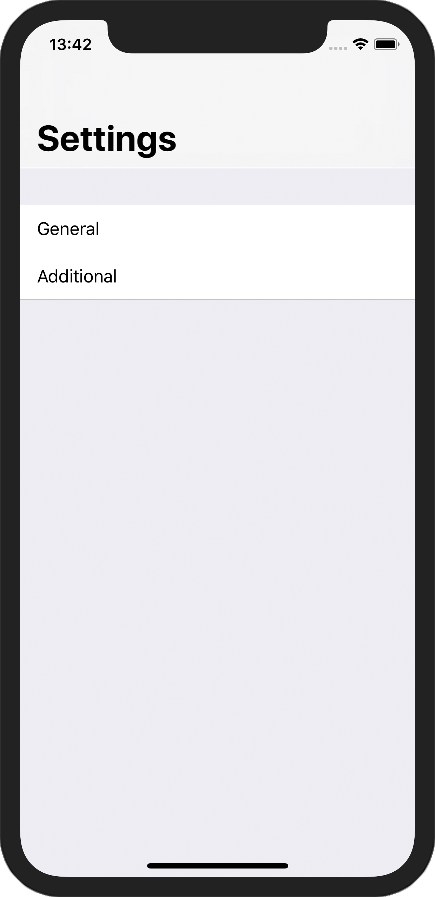
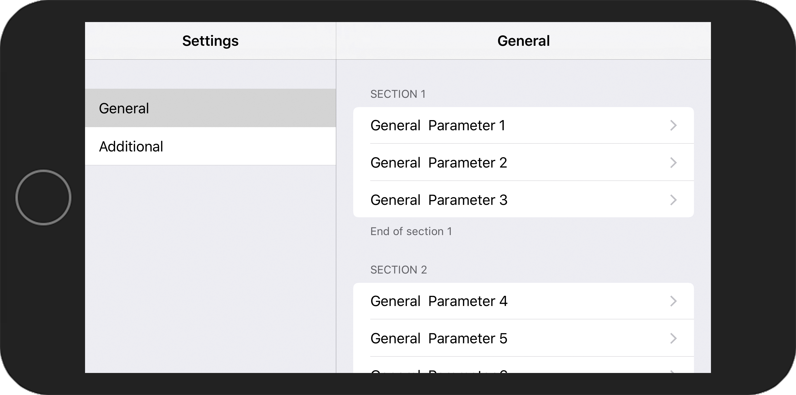
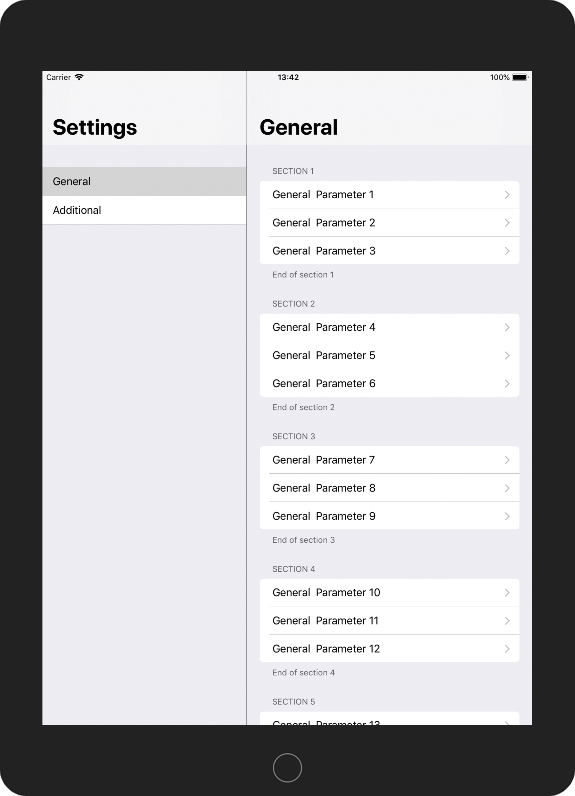

# SettingsSplitViewController
Example of a **UISplitViewController** that looks like the iOS **Settings**.

## Requirements
- Xcode 9.4.1
- Swift 4.1
- iOS 8+

## Screenshots

**iPhone X**  
 

**iPhone 8 Plus**  
 

**iPad 9.7 inch**  

